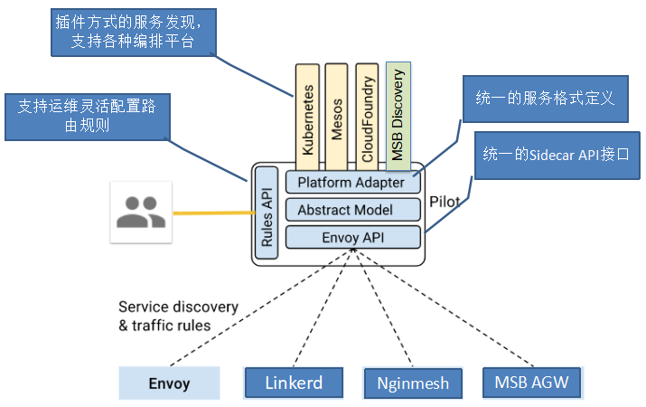

# Istio 服务注册插件机制代码解析

<https://zhaohuabing.com/post/2019-02-18-pilot-service-registry-code-analysis/>

## Istio服务注册插件机制

在Istio架构中，Pilot组件负责维护网格中的标准服务模型，该标准服务模型独立于各种底层平台，Pilot通过适配器和各底层平台对接，以使用底层平台中的服务数据填充此标准模型。

例如Pilot中的Kubernetes适配器通过Kubernetes API Server到kubernetes中的Service以及对应的POD实例，将该数据被翻译为标准模型提供给Pilot使用。通过适配器模式，Pilot还可以从Cloud Foundry, Consul中获取服务信息，也可以开发适配器将其他提供服务发现的组件集成到Pilot中。

本文将从代码出发，对Pilot的服务注册机制进行分析。

## 服务注册相关的对象

首先我们来了解一下Pilot中关于服务注册的一些基本概念和相关数据结构。

Istio源码中，和服务注册相关的对象如下面的UML类图所示。

