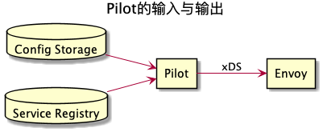
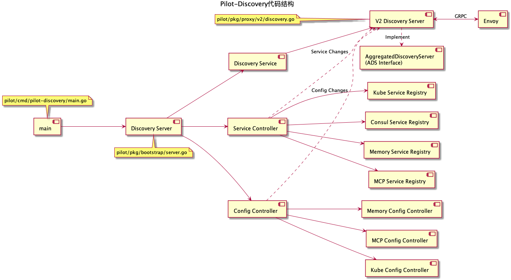
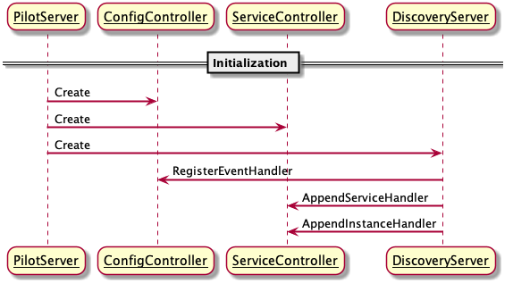
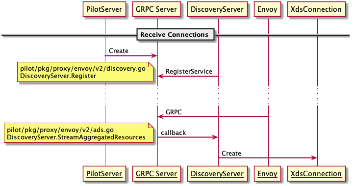
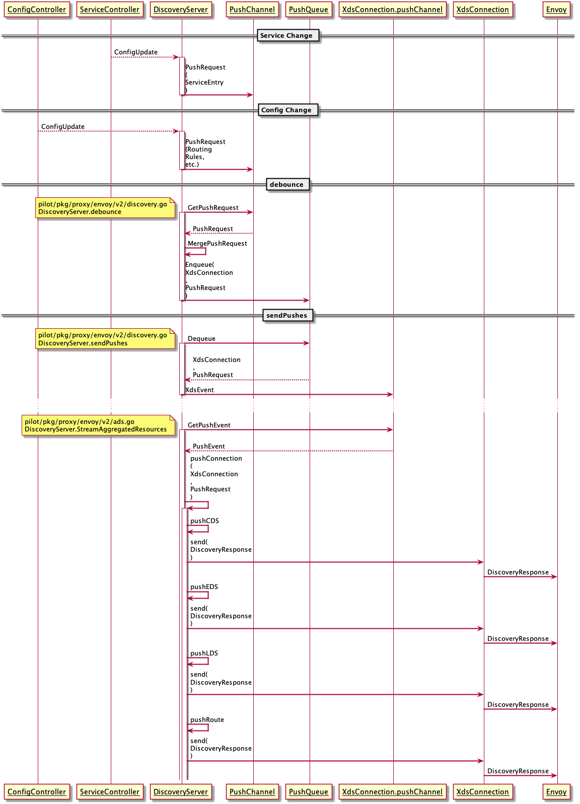
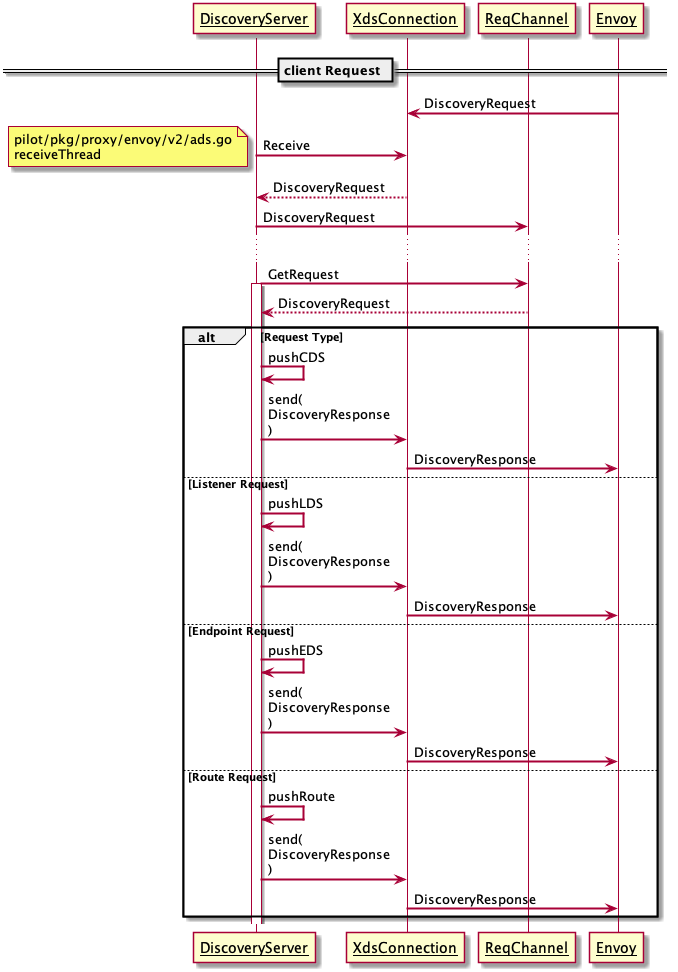
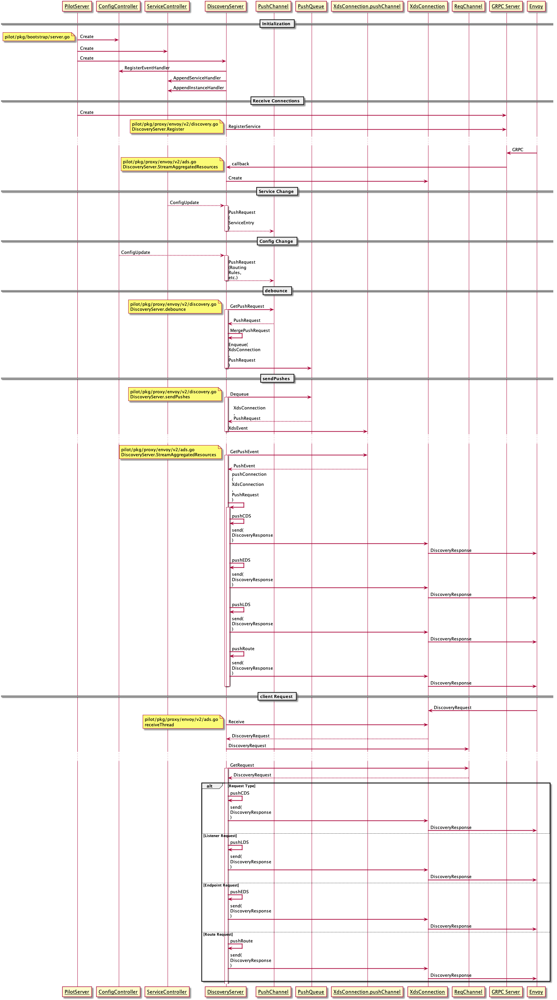

# Istio Pilot代码深度解析

<https://zhaohuabing.com/post/2019-10-21-pilot-discovery-code-analysis/>

## Istio Pilot 组件介绍

在Istio架构中，Pilot组件属于最核心的组件，负责了服务网格中的流量管理以及控制面和数据面之间的配置下发。Pilot内部的代码结构比较复杂，本文中我们将通过对Pilot的代码的深入分析来了解Pilot实现原理。

首先我们来看一下Pilot在Istio中的功能定位，Pilot将服务信息和配置数据转换为xDS接口的标准数据结构，通过GRPC下发到数据面的Envoy。如果把Pilot看成一个处理数据的黑盒，则其有两个输入，一个输出：



目前Pilot的输入包括两部分数据来源：

- 服务数据： 来源于各个服务注册表(Service Registry),例如Kubernetes中注册的Service，Consul Catalog中的服务等。
- 配置规则： 各种配置规则，包括路由规则及流量管理规则等，通过Kubernetes CRD(Custom resources definition)形式定义并存储在Kubernetes中。

Pilot的输出为符合xDS接口的数据面配置数据，并通过GRPC Streaming接口将配置数据推送到数据面的Envoy中。

## Pilot-Discovery 代码结构

Istio Pilot的代码分为Pilot-Discovery和Pilot-Agent,其中Pilot-Agent用于在数据面负责Envoy的生命周期管理，Pilot-Discovery才是控制面进行流量管理的组件，本文将重点分析控制面部分，即Pilot-Discovery的代码。

下图是Pilot-Discovery组件代码的主要结构：



Pilot-Discovery的入口函数为：pilot/cmd/pilot-discovery/main.go中的main方法。main方法中创建了Discovery Server，Discovery Server中主要包含三部分逻辑：

### Config Controller

Config Controller用于管理各种配置数据，包括用户创建的流量管理规则和策略。Istio目前支持三种类型的Config Controller：

- Kubernetes：使用Kubernetes来作为配置数据的存储，该方式的直接依附于Kubernetes强大的CRD机制来存储配置数据，简单方便，是Istio最开始使用的配置存储方案。
- MCP (Mesh Configuration Protocol)：使用Kubernetes来存储配置数据导致了Istio和Kubernetes的耦合，限制了Istio在非Kubernetes环境下的运用。为了解决该耦合，Istio社区提出了MCP，MCP定义了一个向Istio控制面下发配置数据的标准协议，Istio Pilot作为MCP Client，任何实现了MCP协议的Server都可以通过MCP协议向Pilot下发配置，从而解除了Istio和Kubernetes的耦合。如果想要了解更多关于MCP的内容，请参考文后的链接。
- Memory：一个在内存中的Config Controller实现，主要用于测试。

目前Istio的配置包括：

- Virtual Service: 定义流量路由规则。
- Destination Rule: 定义和一个服务或者subset相关的流量处理规则，包括负载均衡策略，连接池大小，断路器设置，subset定义等等。
- Gateway: 定义入口网关上对外暴露的服务。
- Service Entry: 通过定义一个Service Entry可以将一个外部服务手动添加到服务网格中。
- Envoy Filter: 通过Pilot在Envoy的配置中添加一个自定义的Filter。

### Service Controller

Service Controller用于管理各种Service Registry，提出服务发现数据，目前Istio支持的Service Registry包括：

- Kubernetes：对接Kubernetes Registry，可以将Kubernetes中定义的Service和Instance采集到Istio中。
- Consul： 对接Consul Catalog，将Consul中定义的Service采集到Istio中。
- MCP： 和MCP config controller类似，从MCP Server中获取Service和Service Instance。
- Memory： 一个内存中的Service Controller实现，主要用于测试。

### Discovery Service

Discovery Service中主要包含下述逻辑：

- 启动GRPC Server并接收来自Envoy端的连接请求。
- 接收Envoy端的xDS请求，从Config Controller和Service Controller中获取配置和服务信息，生成响应消息发送给Envoy。
- 监听来自Config Controller的配置变化消息和来自Service Controller的服务变化消息，并将配置和服务变化内容通过xDS接口推送到Envoy。（备注：目前Pilot未实现增量变化推送，每次变化推送的是全量配置，在网格中服务较多的情况下可能会有性能问题）。

## Pilot-Discovery 业务流程

Pilot-Disocvery包括以下主要的几个业务流程：

### 初始化Pilot-Discovery的各个主要组件

Pilot-Discovery命令的入口为pilot/cmd/pilot-discovery/main.go中的main方法，在该方法中创建Pilot Server,Server代码位于文件pilot/pkg/bootstrap/server.go中。Server主要做了下面一些初始化工作：

- 创建并初始化Config Controller
- 创建并初始化Service Controller
- 创建并初始化Discovery Server，Pilot中创建了基于Envoy V1 API的HTTP Discovery Server和基于Envoy V2 API的GPRC Discovery Server。由于V1已经被废弃，本文将主要分析V2 API的GRPC Discovery Server。
- 将Discovery Server注册为Config Controller和Service Controller的Event Handler，监听配置和服务变化消息。



### 创建GRPC Server并接收Envoy的连接请求

Pilot Server创建了一个GRPC Server，用于监听和接收来自Envoy的xDS请求。pilot/pkg/proxy/envoy/v2/ads.go 中的 DiscoveryServer.StreamAggregatedResources方法被注册为GRPC Server的服务处理方法。

当GRPC Server收到来自Envoy的连接时，会调用DiscoveryServer.StreamAggregatedResources方法，在该方法中创建一个XdsConnection对象，并开启一个goroutine从该connection中接收客户端的xDS请求并进行处理；如果控制面的配置发生变化，Pilot也会通过该connection把配置变化主动推送到Envoy端。



### 配置变化后向Envoy推送更新

这是Pilot中最复杂的一个业务流程，主要是因为代码中采用了多个channel和queue对变化消息进行合并和转发。该业务流程如下：

- Config Controller或者Service Controller在配置或服务发生变化时通过回调方法通知Discovery Server，Discovery Server将变化消息放入到Push Channel中。
- Discovery Server通过一个goroutine从Push Channel中接收变化消息，将一段时间内连续发生的变化消息进行合并。如果超过指定时间没有新的变化消息，则将合并后的消息加入到一个队列Push Queue中。
- 另一个goroutine从Push Queue中取出变化消息，生成XdsEvent，发送到每个客户端连接的Push Channel中。
- 在DiscoveryServer.StreamAggregatedResources方法中从Push Channel中取出XdsEvent，然后根据上下文生成符合xDS接口规范的DiscoveryResponse，通过GRPC推送给Envoy端。（GRPC会为每个client连接单独分配一个goroutine来进行处理，因此不同客户端连接的StreamAggregatedResources处理方法是在不同goroutine中处理的）



### 响应Envoy主动发起的xDS请求

Pilot和Envoy之间建立的是一个双向的Streaming GRPC服务调用，因此Pilot可以在配置变化时向Envoy推送，Envoy也可以主动发起xDS调用请求获取配置。Envoy主动发起xDS请求的流程如下：

- Envoy通过创建好的GRPC连接发送一个DiscoveryRequest
- Discovery Server通过一个goroutine从XdsConnection中接收来自Envoy的DiscoveryRequest，并将请求发送到ReqChannel中
- Discovery Server的另一个goroutine从ReqChannel中接收DiscoveryRequest，根据上下文生成符合xDS接口规范的DiscoveryResponse，然后返回给Envoy。



## Discovery Server业务处理关键代码片段

下面是Discovery Server的关键代码片段和对应的业务逻辑注解，为方便阅读，代码中只保留了逻辑主干，去掉了一些不重要的细节。

### 处理xDS请求和推送的关键代码

该部分关键代码位于 istio.io/istio/pilot/pkg/proxy/envoy/v2/ads.go 文件的StreamAggregatedResources 方法中。StreamAggregatedResources方法被注册为GRPC Server的handler，对于每一个客户端连接，GRPC Server会启动一个goroutine来进行处理。

代码中主要包含以下业务逻辑：

- 从GRPC连接中接收来自Envoy的xDS 请求，并放到一个channel reqChannel中
- 从reqChannel中接收xDS请求，根据xDS请求的类型构造响应并发送给Envoy
- 从connection的pushChannel中接收Service或者Config变化后的通知，构造xDS响应消息，将变化内容推送到Envoy端

```golang
// StreamAggregatedResources implements the ADS interface.
func (s *DiscoveryServer) StreamAggregatedResources(stream ads.AggregatedDiscoveryService_StreamAggregatedResourcesServer) error {

......

//创建一个goroutine来接收来自Envoy的xDS请求，并将请求放到reqChannel中
con := newXdsConnection(peerAddr, stream)
reqChannel := make(chan *xdsapi.DiscoveryRequest, 1)
go receiveThread(con, reqChannel, &receiveError)

 ......

for {
    select{
    //从reqChannel接收Envoy端主动发起的xDS请求
    case discReq, ok := <-reqChannel:
        //根据请求的类型构造相应的xDS Response并发送到Envoy端
        switch discReq.TypeUrl {
        case ClusterType:
            err := s.pushCds(con, s.globalPushContext(), versionInfo())
        case ListenerType:
            err := s.pushLds(con, s.globalPushContext(), versionInfo())
        case RouteType:
            err := s.pushRoute(con, s.globalPushContext(), versionInfo())
        case EndpointType:
            err := s.pushEds(s.globalPushContext(), con, versionInfo(), nil)
        }

    //从PushChannel接收Service或者Config变化后的通知
    case pushEv := <-con.pushChannel:
        //将变化内容推送到Envoy端
        err := s.pushConnection(con, pushEv)
    }
}
}
```

### 处理服务和配置变化的关键代码

该部分关键代码位于 istio.io/istio/pilot/pkg/proxy/envoy/v2/discovery.go 文件中，用于监听服务和配置变化消息，并将变化消息合并后通过Channel发送给前面提到的 StreamAggregatedResources 方法进行处理。

ConfigUpdate是处理服务和配置变化的回调函数，service controller和config controller在发生变化时会调用该方法通知Discovery Server。

```golang
func (s *DiscoveryServer) ConfigUpdate(req *model.PushRequest) {
    inboundConfigUpdates.Increment()

    //服务或配置变化后，将一个PushRequest发送到pushChannel中
    s.pushChannel <- req
}
```

在debounce方法中将连续发生的PushRequest进行合并，如果一段时间内没有收到新的PushRequest，再发起推送；以避免由于服务和配置频繁变化给系统带来较大压力。

```golang
// The debounce helper function is implemented to enable mocking
func debounce(ch chan *model.PushRequest, stopCh <-chan struct{}, pushFn func(req *model.PushRequest)) {

    ......

    pushWorker := func() {
        eventDelay := time.Since(startDebounce)
        quietTime := time.Since(lastConfigUpdateTime)

        // it has been too long or quiet enough
        //一段时间内没有收到新的PushRequest，再发起推送
        if eventDelay >= DebounceMax || quietTime >= DebounceAfter {
            if req != nil {
                pushCounter++
                adsLog.Infof("Push debounce stable[%d] %d: %v since last change, %v since last push, full=%v",
                pushCounter, debouncedEvents,
                quietTime, eventDelay, req.Full)

                free = false
                go push(req)
                req = nil
                debouncedEvents = 0
            }
        } else {
           timeChan = time.After(DebounceAfter - quietTime)
        }
    }
    for {
        select {
        ......

        case r := <-ch:
            lastConfigUpdateTime = time.Now()
            if debouncedEvents == 0 {
                timeChan = time.After(DebounceAfter)
                startDebounce = lastConfigUpdateTime
            }
            debouncedEvents++
            //合并连续发生的多个PushRequest
            req = req.Merge(r)
        case <-timeChan:
           if free {
               pushWorker()
            }
        case <-stopCh:
            return
    }
  }
}
```

## 完整的业务流程


